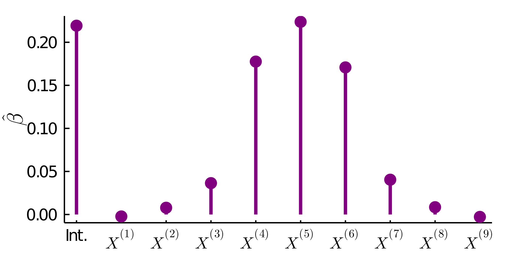

# Aurora: Averages of Units by Regressing on Ordered Replicates Adaptively.


[](https://github.com/nignatiadis/Aurora.jl/actions)
[](https://codecov.io/gh/nignatiadis/Aurora.jl)

Julia implementation of 

> Ignatiadis, N., Saha, S., Sun D. L., & Muralidharan, O. (2019).  **Empirical Bayes mean estimation with nonparametric errors via order statistic regression.** [[arXiv]](https://arxiv.org/abs/1911.05970)

## Installation

The package is available on the Julia registry, and may be installed as follows:

```julia
using Pkg
Pkg.add("Aurora")
```

## Example usage

Example code for Auroral (Aurora with linear regression) and AuroraKNN (Aurora with k-Nearest Neighbor regression)
```julia
julia> using Aurora
julia> using Distributions
julia> using Random
julia> Random.seed!(100)

# generate true means
julia> μs = rand(DiscreteNonParametric([-1, 1, 2], [1/3,1/3,1/3]), 20_000); 
# 10 noisy observations for each mean
julia> zs = sqrt(5) .* rand(Laplace(), 20_000, 10) .+ μs; 
# Aurora.jl wrapper of replicates
julia> Zs = ReplicatedSample.(zs);

# Fitting
julia> auroral_fit = fit(Auroral(), Zs);
julia> auroraknn_fit = fit(AuroraKNN(), Zs);

# Mean squared error (against ground truth) 
julia> mean(abs2, μs .- predict(auroral_fit)) # MSE of Auroral
0.4837658847631636

julia> mean(abs2, μs .- predict(auroraknn_fit)) # MSE of AuroraKNN
0.41354273158179894

julia> mean(abs2, μs .- mean.(Zs)) # Compare to MSE of row-wise mean
0.9779579821238457
```


Plot learned coefficients of Auroral:

```julia
julia> using Plots
julia> plot(auroral_fit)
```

